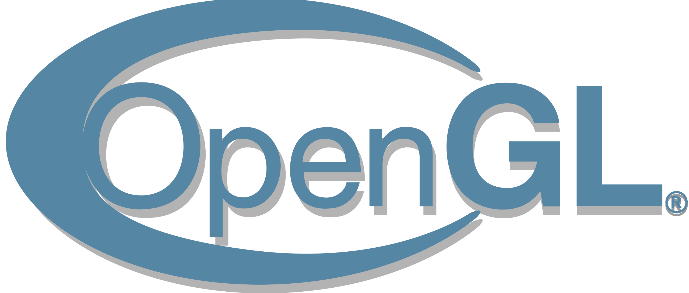
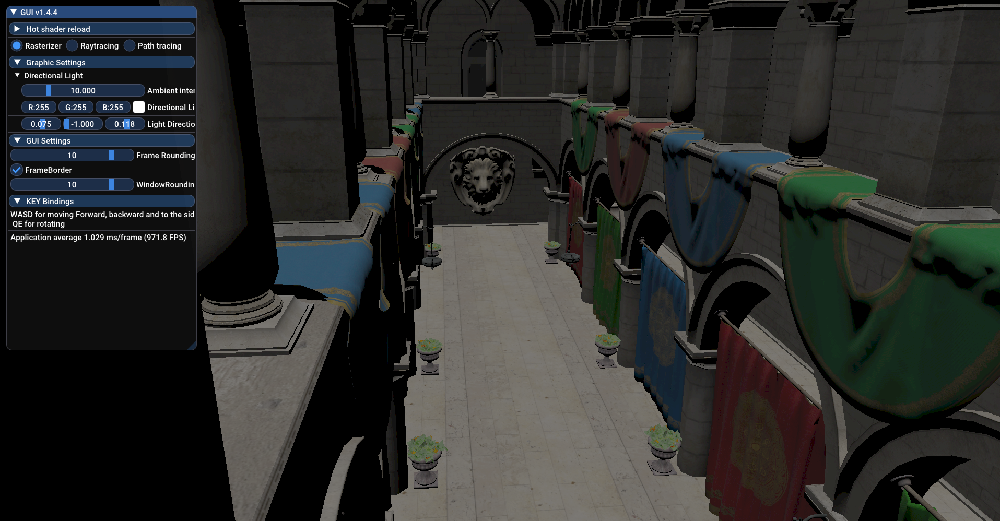
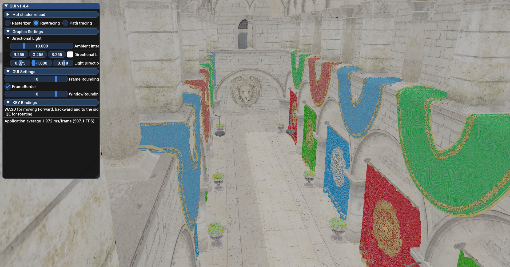
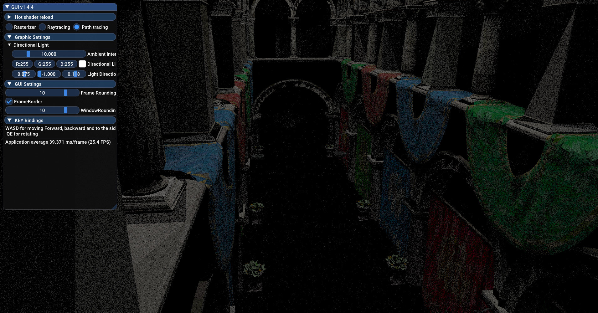
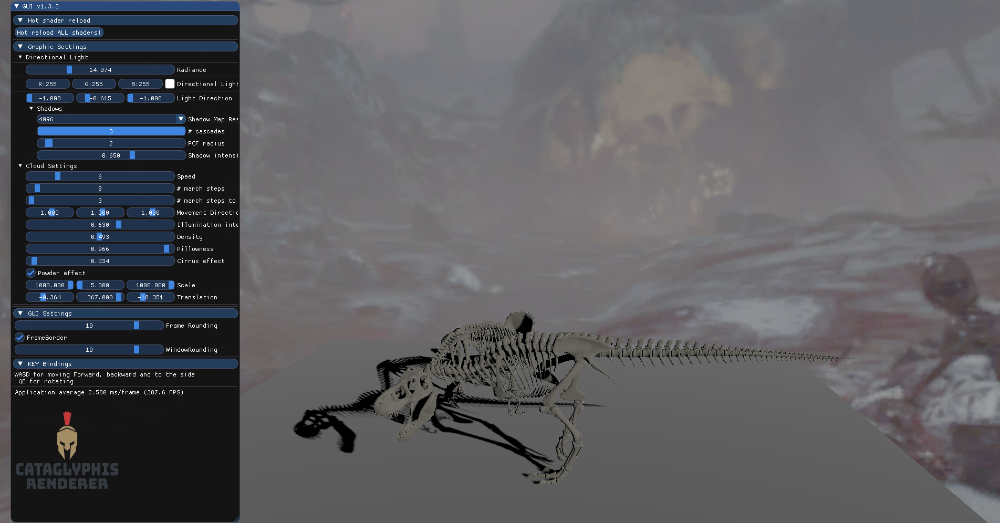
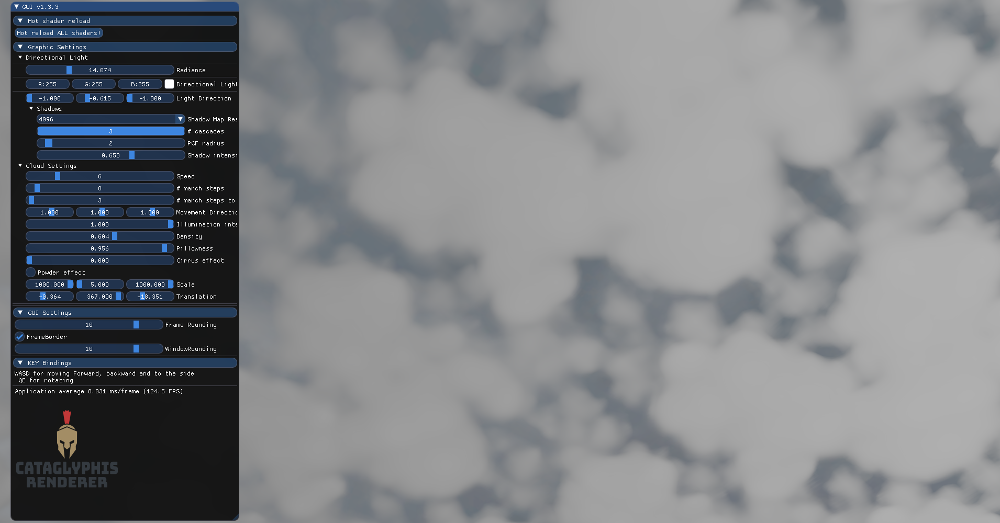
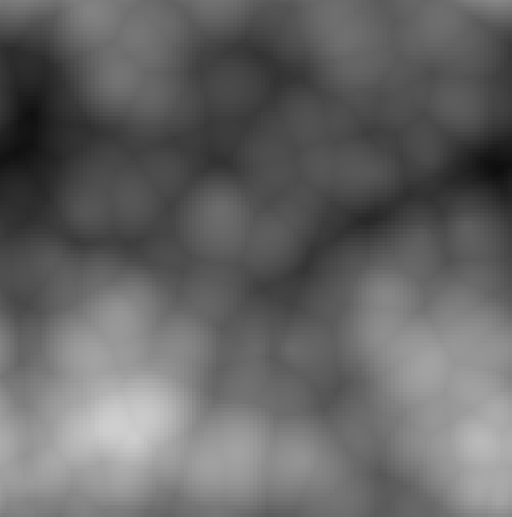
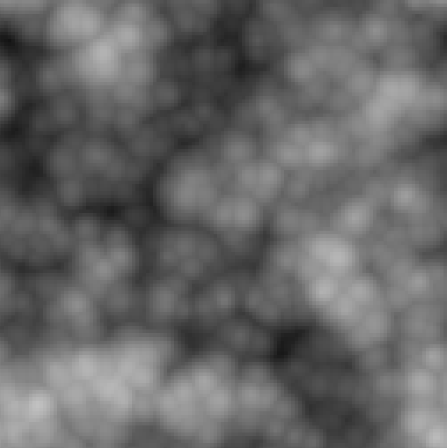

<h1 align="center">
  <br>
  <a href="https://jonasheinle.de"></a>
  <br>
  Kataglyphis Renderer 
  <br>
</h1>

<h1 align="center">
  <br>
  <a href="https://jonasheinle.de"></a>
  <a href="https://jonasheinle.de"></a>
  <a href="https://jonasheinle.de"></a>
  <a href="https://jonasheinle.de"></a>
</h1>

<h4 align="center">A graphics engine built on top of Vulkan+OpenGL <a href="https://jonasheinle.de" target="_blank"></a>.</h4>

[](https://github.com/Kataglyphis/GraphicsEngineVulkan/actions/workflows/Linux.yml)
[](https://github.com/Kataglyphis/GraphicsEngineVulkan/actions/workflows/Windows.yml)
[]()
[](https://www.paypal.com/donate/?hosted_button_id=BX9AVVES2P9LN)
[](https://twitter.com/Cataglyphis_)
[](https://www.youtube.com/channel/UC3LZiH4sZzzaVBCUV8knYeg)


<p align="center">
  <a href="#key-features">Key Features</a> •
  <a href="#how-to-use">How To Use</a> •
  <a href="#download">Download</a> •
  <a href="#credits">Credits</a> •
  <a href="#related">Related</a> •
  <a href="#license">License</a>
</p>

<!-- TABLE OF CONTENTS -->
<details open="open">
  <summary>Table of Contents</summary>
  <ol>
    <li>
      <a href="#about-the-project">About The Project</a>
      <ul>
        <li><a href="#built-with">Built With</a></li>
      </ul>
      <ul>
        <li><a href="#key-features">Key Features</a></li>
      </ul>
    </li>
    <li>
      <a href="#getting-started">Getting Started</a>
      <ul>
        <li><a href="#prerequisites">Prerequisites</a></li>
        <li><a href="#installation">Installation</a></li>
      </ul>
    </li>
    <li><a href="#shaders">Shaders</a></li>
    <li><a href="#tests">Tests</a></li>
    <li><a href="#roadmap">Roadmap</a></li>
    <li><a href="#contributing">Contributing</a></li>
    <li><a href="#license">License</a></li>
    <li><a href="#contact">Contact</a></li>
    <li><a href="#acknowledgements">Acknowledgements</a></li>
    <li><a href="#acknowledgements">Literature</a></li>
    <li><a href="#acknowledgements">Common issues</a></li>
  </ol>
</details>

<!-- ABOUT THE PROJECT -->
## About The Project

<h1 align="center">
  <br>
  <a href="https://jonasheinle.de"></a>
  <a href="https://jonasheinle.de"></a>
  <a href="https://jonasheinle.de"></a>
</h1>

<h1 align="center">
  <br>
  <a href="https://jonasheinle.de"></a>
  <a href="https://jonasheinle.de"></a>
  <br>
  <a href="https://jonasheinle.de"></a>
  <a href="https://jonasheinle.de"></a>
</h1>

<!-- [![Kataglyphis Engine][product-screenshot1]](https://jotrockenmitlocken.de)
[![Kataglyphis Engine][product-screenshot2]](https://jotrockenmitlocken.de)
[![Kataglyphis Engine][product-screenshot3]](https://jotrockenmitlocken.de) -->

This project provides me a solid Vulkan renderer starting point
for implementing modern established rendering techniques and getting quickly
started in own research topics. 
Frequently tested under <br /> 
* [latest windows and ubuntu version]
* [GCC/CLANG/MSVC] 

### Key Features

<div align="center">


|            Category           |           Feature                             |  Implement Status  |
|-------------------------------|-----------------------------------------------|:------------------:|
|  **Vulkan Render agnostic**   | Rasterizer                                    |         ✔️         |
|                               | Raytracing                                    |         ✔️         |
|                               | Path tracing                                  |         ✔️         |
|                               | PBR support (UE4, Disney, etc.)               |         ✔️         |
|                               | .obj Model loading                            |         ✔️         |
|                               | Mip Mapping                                   |         ✔️         |
|  **OpenGL Render agnostic**   |                                               |                   |
|                               | Directional Lights                            |         ✔️         |
|                               | Point Lights                                  |         ✔️         |
|                               | Spot Lights                                   |         ✔️         |
|                               | Directional Shadow Mapping                    |         ✔️         |
|                               | Omni-Directional Shadow Mapping               |         ✔️         |
|                               | Cascaded Shadow Mapping                       |         ✔️         |
|                               | Cloud system                                  |         ✔️         |
|                               | 3D-worley noise generation                    |         ✔️         |
|                               | .obj Model loading                            |         ✔️         |
|                               | PBR support (UE4,disney,phong, etc.)          |         ✔️         |
|                               | Support for `#include` directives in shaders. |         ✔️         |
|                               | Sky box                                       |         ✔️         |
|                               | Supporting compute shader                     |         ✔️         |
|                               | On the fly 3D worley/perlin noise creation    |         ✔️         |
|      **C++/CMake agnostic**   | Code coverage for Clang                       |         ✔️         |
|                               | Advanced unit testing                         |         🔶        |
|                               | Advanced performance testing                  |         🔶        |
|                               | Advanced fuzz testing                         |         🔶        |

</div>

**Legend:**
- ✔️ - completed  
- 🔶 - in progress  
- ❌ - not started


### Built With

* [Vulkan 1.3](https://www.vulkan.org/)
* [OpenGL 4.6](https://www.opengl.org//)
* [GLAD](https://glad.dav1d.de/)
* [glm](https://github.com/g-truc/glm)
* [glfw](https://www.glfw.org/)
* [tinyobjloader](https://github.com/tinyobjloader/tinyobjloader)
* [stb](https://github.com/nothings/stb)
* [vma](https://github.com/GPUOpen-LibrariesAndSDKs/VulkanMemoryAllocator)
* [tinygltf](https://github.com/syoyo/tinygltf)
* [doxygen](https://www.doxygen.nl/index.html)
* [gtest](https://github.com/google/googletest)
* [gbenchmark](https://github.com/google/benchmark)
* [google fuzztest](https://github.com/google/fuzztest)
* [cmake](https://cmake.org/)
* [gsl](https://github.com/Microsoft/GSL)
* [NSIS](https://nsis.sourceforge.io/Main_Page)
* [nlohmann_json](https://github.com/nlohmann/json)
* [SPDLOG](https://github.com/gabime/spdlog)
### Useful tools (you might also considering :) )

* [cppcheck](https://cppcheck.sourceforge.io/)
* [renderdoc](https://renderdoc.org/)
* [nsightgraphics](https://developer.nvidia.com/nsight-graphics)
* [valgrind](https://valgrind.org/)
* [clangtidy](https://github.com/llvm/llvm-project)
* [visualstudio](https://visualstudio.microsoft.com/de/)
* [ClangPowerTools](https://www.clangpowertools.com/)
* [Codecov](https://app.codecov.io/gh)

<!-- GETTING STARTED -->
## Getting Started

### Prerequisites

Dependencies to libraries are stated above.<br />
C++23 or higher required.<br />
C17 or higher required.<br />
CMake 3.28.3 or higher required.<br />
> **_NOTE:_** This project relies on the new hardware capabilities for RRT.


### Installation

1. Clone the repo
   ```sh
   git clone --recurse-submodules git@github.com:Kataglyphis/GraphicsEngineVulkan.git
   ```

2. Then build your solution with [CMAKE] (https://cmake.org/) <br />
  Here the recommended way over command line after cloning the repo:<br />
  > **_NOTE:_** Here we use CmakePresets to simplify things. Consider using it too
  or just build on a common way ... 
  
  (for clarity: Assumption you are in the dir you have cloned the repo into)
  ```sh
  $ mkdir build ; cd build
  # enlisting all available presets
  $ cmake --list-presets=all ../
  $ cmake --preset <configurePreset-name> ../
  $ cmake --build --preset <buildPreset-name> .
  ```
  Alternatively you can use the build scripts I use for my standard configuration: <br/>
  * [`buildEngine.sh`] 
  * [`buildEngine.bat`]
  ```sh
  $ {WORKING_DIR}/GraphicsEngineVulkan/buildEngine[.sh/.bat]
  ```

# Shaders
I provide two ways for compiling shaders with. Hence if you want to add new
files as `#include` in your shaders you have to modify the files: (should be self-explanatory)<br/>
* [`include/vulkan_base/ShaderIncludes.hpp`] 
* [`cmake/CompileShadersToSPV.cmake`]

appropriately.</br>


# Tests
I have two tests suites.

1. Compilation Test Suite: This suite gets executed every compilation step. This ensures the very most important functionality is correct before every compilation.

2. Commit Test Suite: This gets executed on every push. More expensive tests are allowed :) 

## Static Analyzers

```bash
clang --analyze --output-format html $(find Src -name '*.cpp' -o -name '*.cc')
scan-build cmake --build .
clang-tidy -p=./build/compile_commands.json  $(find Src -name '*.cpp' -o -name '*.cc')

```

# Format cmake files

```bash
conda create -n cmake_formating python=3.10
pip install pyyaml
pip install cmake-format
cmake-format -c ./.cmake-format.yaml -i $(find cmake -name '*.cmake' -o -name 'CMakeLists.txt')
```
# Format code files 

```bash
clang-format -i $(find include -name "*.cpp" -or -name "*.h" -or -name "*.hpp")
```

<!-- ROADMAP -->
## Roadmap
Watch the refman generated by doxygen. <br/>
* [Watch it here](Documents/refman.pdf)

<!-- CONTRIBUTING -->
## Contributing

Contributions are what make the open source community such an amazing place to be learn, inspire, and create. Any contributions you make are **greatly appreciated**.

1. Fork the Project
2. Create your Feature Branch (`git checkout -b feature/AmazingFeature`)
3. Commit your Changes (`git commit -m 'Add some AmazingFeature'`)
4. Push to the Branch (`git push origin feature/AmazingFeature`)
5. Open a Pull Request


<!-- LICENSE -->
## License

Distributed under the BSD 3-Clause "New" or "Revised" License. See `LICENSE` for more information.


<!-- CONTACT -->
## Contact

Jonas Heinle - [@Cataglyphis_](https://twitter.com/Cataglyphis_) - renderdude@jotrockenmitlocken.de

Project Link: [https://github.com/Kataglyphis/GraphicsEngineVulkan](https://github.com/Kataglyphis/GraphicsEngineVulkan)


<!-- ACKNOWLEDGEMENTS -->
## Acknowledgements

You will find important links to information in the code.
But here in general some good sources of information:

Thanks for free 3D Models: 
* [Morgan McGuire, Computer Graphics Archive, July 2017 (https://casual-effects.com/data)](http://casual-effects.com/data/)

* [Viking room](https://sketchfab.com/3d-models/viking-room-a49f1b8e4f5c4ecf9e1fe7d81915ad38)

* [Loading Screen Image](https://www.golem.de/news/raumfahrt-spacex-macht-sicherheitstest-bei-hoechster-belastung-2001-146124.html)


## Literature 

Some very helpful literature, tutorials, etc. 

* [View Frustum Culling](http://www.lighthouse3d.com/tutorials/view-frustum-culling/geometric-approach-extracting-the-planes/)

CMake/C++
* [Cpp best practices](https://github.com/cpp-best-practices/cppbestpractices)

OpenGL 
* [learnopengl.com](https://learnopengl.com/)
* [ogldev.org](https://ogldev.org/)
* [Cascaded Shadow Maps](https://ahbejarano.gitbook.io/lwjglgamedev/chapter26)
* [Compute Shader in OpenGL](https://antongerdelan.net/opengl/compute.html)

Clouds
* [pbr-book](https://www.pbr-book.org/)
* [Inigo Quilez](https://iquilezles.org)
* [Shadertoy Horizon Zero Dawn](https://www.shadertoy.com/view/WddSDr)
* [Sebastian Lague](https://m.youtube.com/watch?v=4QOcCGI6xOU&t=97s)
* [Horizon Zero Dawn](http://advances.realtimerendering.com/s2015/The%20Real-time%20Volumetric%20Cloudscapes%20of%20Horizon%20-%20Zero%20Dawn%20-%20ARTR.pdf)
* [Clouds and noise](https://thebookofshaders.com/12/)
* [Shadertoy Clouds using 3D Perlin noise](https://www.shadertoy.com/view/XlKyRw)

Noise
* [Worley noise online demo](https://github.com/Erkaman/glsl-worley)

Vulkan
* [Udemy course by Ben Cook](https://www.udemy.com/share/102M903@JMHgpMsdMW336k2s5Ftz9FMx769wYAEQ7p6GMAPBsFuVUbWRgq7k2uY6qBCG6UWNPQ==/)
* [Vulkan Tutorial](https://vulkan-tutorial.com/)
* [Vulkan Raytracing Tutorial](https://developer.nvidia.com/rtx/raytracing/vkray)
* [Vulkan Tutorial; especially chapter about integrating imgui](https://frguthmann.github.io/posts/vulkan_imgui/)
* [NVidia Raytracing tutorial with Vulkan](https://nvpro-samples.github.io/vk_raytracing_tutorial_KHR/)
* [Blog from Sascha Willems](https://www.saschawillems.de/)

Physically Based Shading
* [Advanced Global Illumination by Dutre, Bala, Bekaert](https://www.oreilly.com/library/view/advanced-global-illumination/9781439864951/)
* [The Bible: PBR book](https://pbr-book.org/3ed-2018/Reflection_Models/Microfacet_Models)
* [Real shading in Unreal engine 4](https://blog.selfshadow.com/publications/s2013-shading-course/karis/s2013_pbs_epic_notes_v2.pdf)
* [Physically Based Shading at Disney](https://blog.selfshadow.com/publications/s2012-shading-course/burley/s2012_pbs_disney_brdf_notes_v3.pdf)
* [RealTimeRendering](https://www.realtimerendering.com/)
* [Understanding the Masking-Shadowing Function in Microfacet-Based BRDFs](https://hal.inria.fr/hal-01024289/)
* [Sampling the GGX Distribution of Visible Normals](https://pdfs.semanticscholar.org/63bc/928467d760605cdbf77a25bb7c3ad957e40e.pdf)

Path tracing
* [NVIDIA Path tracing Tutorial](https://github.com/nvpro-samples/vk_mini_path_tracer/blob/main/vk_mini_path_tracer/main.cpp)

## Common issues

<!-- MARKDOWN LINKS & IMAGES -->
<!-- https://www.markdownguide.org/basic-syntax/#reference-style-links -->
[contributors-shield]: https://img.shields.io/github/contributors/othneildrew/Best-README-Template.svg?style=for-the-badge
[contributors-url]: https://github.com/othneildrew/Best-README-Template/graphs/contributors
[forks-shield]: https://img.shields.io/github/forks/othneildrew/Best-README-Template.svg?style=for-the-badge
[forks-url]: https://github.com/othneildrew/Best-README-Template/network/members
[stars-shield]: https://img.shields.io/github/stars/othneildrew/Best-README-Template.svg?style=for-the-badge
[stars-url]: https://github.com/othneildrew/Best-README-Template/stargazers
[issues-shield]: https://img.shields.io/github/issues/othneildrew/Best-README-Template.svg?style=for-the-badge
[issues-url]: https://github.com/othneildrew/Best-README-Template/issues
[license-shield]: https://img.shields.io/github/license/othneildrew/Best-README-Template.svg?style=for-the-badge
[license-url]: https://github.com/othneildrew/Best-README-Template/blob/master/LICENSE.txt
[linkedin-shield]: https://img.shields.io/badge/-LinkedIn-black.svg?style=for-the-badge&logo=linkedin&colorB=555
[linkedin-url]: https://www.linkedin.com/in/jonas-heinle-0b2a301a0/
[product-screenshot1]: images/Screenshot1.png
[product-screenshot2]: images/Screenshot2.png
[product-screenshot3]: images/Screenshot3.png


